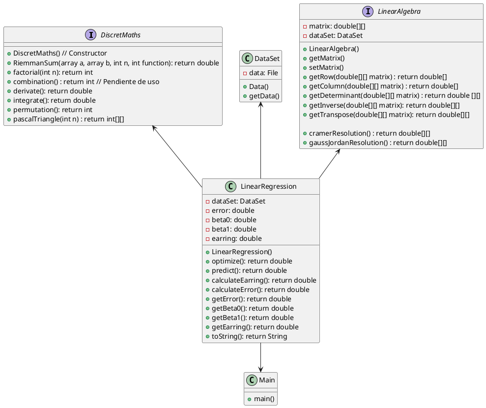

# Aplicación de cálculo diferencial a Machine Learning - Hands on 4

### Entrada de datos

- Hardcodear los datos de entrada en el código

- Inyectar el valor de entrada desde la terminal al ejecutar el programa

### Salida de datos

- Imprimir la ecuación de la regresíon lineal en la terminal reemplazando los valores optimos para la siguiente ecuación $ \hat{y} = \beta_0 + \beta_1x_1 $
- Imprimir los resultados en la terminal
- A patir de un valor X de entrada, predecir el valor de Y

## Diagrama de clases UML

Este programa estara desarrollado en Java, por lo que se utilizara el siguiente diagrama de clases UML para representar la estructura del programa.

## Caso a analizar

El caso en el que vamos a trabajar es el caso de la empresa Benneton, para calculas sus ventas respectos a sus gastos en publicidad a lo largo de 9 años y poder generar una predicción de ventas para años posteriores.